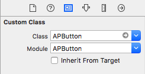

# APButton

[](https://github.com/apple/swift-package-manager)
[](http://cocoapods.org/pods/APButton)
[](http://cocoapods.org/pods/APButton)
[](http://cocoapods.org/pods/APButton)
[](https://travis-ci.org/APUtils/APButton)

Button with ability to show loading indicator and animate depended views according to button state. Try to mimic system button animations while provides ability to make button from several views: background view, image view, overlay view, etc.

## Example

To run the example project, clone the repo, and run `pod install` from the Example directory first.

## GIF animations

#### Activity indication:


#### Tap:


## Installation

#### CocoaPods

APButton is available through [CocoaPods](http://cocoapods.org). To install
it, simply add the following line to your Podfile:

```ruby
pod 'APButton', '~> 6.0'
```

## Usage

#### Setup

Set custom class for your button in storyboard, **assure module field is also `APButton`**:



Add as many dependend views as you like:


Button outlet example:

```swift
@IBOutlet private weak var button: APButton!
```

Button action example:

```swift
@IBAction private func onButonTap(_ sender: APButton) {}
```

#### Configuration


You can set overlay color so instead of dim dependend views button will put overlay over self.

Setting `rounded` to `On` will make button corners rounded.

#### Activity

To start activity call `button.startAnimating()`, to finish call `button.stopAnimating()`.

#### State changes

Button animations for taps are automatic.

If you want your dependend labels to change color for disabled state, their color should match APButton title color for state `normal` and their disabled state color will be APButton title color for state `disabled` then.


There are many ways and a lot of flexibility of how you can compose your button. See example project for more details.

## Contributions

Any contribution is more than welcome! You can contribute through pull requests and issues on GitHub.

## Author

Anton Plebanovich, anton.plebanovich@gmail.com

## License

APButton is available under the MIT license. See the LICENSE file for more info.
